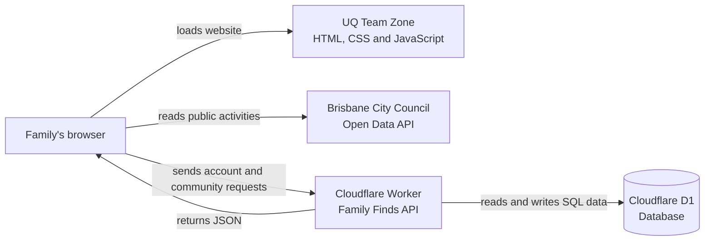

# Family Finds

## Project background


Family Finds is a real website designed to help Brisbane families and caregivers find affordable things to do and connect with people nearby. The target audience includes households managing limited budgets, parents looking for suitable activities, and families who want stronger local connections.

The original project explored activities, grocery discounts, second-hand shopping and reuse. Grocery and marketplace data was difficult to access through reliable free APIs, so the project now has a clearer focus:

- Find current free and low-cost family activities using Brisbane City Council Open Data.
- Discover local clubs using suburb, interests and family age groups.
- Let families join clubs, start discussions, reply to posts and share useful links.
- Help club members see when people they know are interested in the same event.
- Allow a club to include an optional Facebook or Messenger link while keeping the main community experience inside Family Finds.

The website uses plain HTML, CSS and JavaScript. Its interface is designed to be clean, responsive and quick to understand on a phone.

## Technology overview

| Part | Technology | Purpose |
|---|---|---|
| Frontend | HTML, CSS and vanilla JavaScript | Displays pages, filters events and handles user interaction. |
| Frontend hosting | UQ Team Zone | Serves `index.html`, styles, scripts and images. |
| Event source | Brisbane City Council Open Data API | Supplies current Brisbane events and activities without an API key. |
| Backend API | Cloudflare Worker | Validates requests, manages accounts and runs community features. |
| Database | Cloudflare D1 | Stores profiles, clubs, discussions, saved events and event interest. |
| Authentication | Built-in email and password accounts | Creates secure sessions without Google login or another paid service. |

The project is designed to use free services only. The UQ Team Zone hosts the frontend, and the backend uses the Cloudflare Workers and D1 Free plans. If a Cloudflare free-plan daily limit is reached, requests fail until the limit resets instead of the project automatically upgrading.

## How the system works



1. A visitor opens `index.html` from the UQ Team Zone.
2. The browser loads the HTML, CSS and JavaScript files from `frontend/`.
3. `events-api.js` requests public event records directly from the Brisbane City Council API. It converts dates, costs, locations, categories and age information into the format used by the event cards.
4. `community.js` sends account and community requests to the Cloudflare Worker.
5. The Worker validates the request, checks the signed-in user when required and runs prepared SQL queries against D1.
6. The Worker returns JSON, and the frontend updates the page without requiring a full reload.

The UQ server only hosts static frontend files. It does not need to run Node.js or store user accounts. All shared and private application data is handled by the Cloudflare backend.

## How the backend works

The backend is a JavaScript Cloudflare Worker in `backend/src/worker.js`. Its public production address is:

```text
https://family-finds-api.zeyi-yang.workers.dev
```

`frontend/js/config.js` selects the correct backend automatically:

- Local website: `http://127.0.0.1:8787`
- Deployed UQ website: the production Cloudflare Worker URL

The Worker provides these groups of API functions:

| API area | What it does |
|---|---|
| Authentication | Register, log in, log out and check the current session. |
| Profiles | Read and update profile details and privacy choices. |
| Clubs | List, create and update clubs; join, leave and view members. |
| Discussions | Create posts, read discussions, reply and add helpful reactions. |
| Saved events | Save or remove a council activity for a signed-in account. |
| Event interest | Record interest and find interested members from shared clubs. |

### Account and session flow

1. Registration sends a name, email, password, suburb and interests to the Worker over HTTPS.
2. The Worker validates every field and rejects duplicate email addresses.
3. The password is combined with a random salt and processed with PBKDF2-SHA-256. The plain password is never stored.
4. The Worker creates a random session token after registration or login.
5. The browser stores the token and sends it as a Bearer token with authenticated API requests.
6. D1 stores only a SHA-256 hash of the session token. Sessions expire after 30 days and logout deletes the active session.

### Database contents

Cloudflare D1 is a serverless SQL database. The schema is managed by the numbered SQL files in `backend/migrations/`.

| Table | Stored information |
|---|---|
| `profiles` | Account identity, display name, suburb, bio, interests and privacy settings. |
| `sessions` | Hashed login tokens and expiry times. |
| `clubs` | Club owner, name, suburb, description, interests, ages and optional Facebook link. |
| `memberships` | Which profiles belong to each club. |
| `posts` | Community and club discussions. |
| `replies` | Replies attached to discussions. |
| `reactions` | Helpful reactions from members. |
| `saved` | Council events saved by each account. |
| `event_interest` | Events that members want to attend. |

### Validation and privacy

- The Worker accepts browser mutations only from approved Family Finds origins.
- Protected routes require a valid session.
- Club discussions and member lists require club membership.
- Profile privacy settings control whether suburb and interests are shown.
- Event interest only exposes people who share a club with the signed-in member.
- Emails, password hashes, salts, session hashes and private family age settings are never included in public profile responses.
- User text has length limits, and shared links must use HTTPS.
- Optional club social links are restricted to Facebook and Messenger domains.

## Project structure

```text
.
├── frontend/
│   ├── index.html          # Website homepage and page shell
│   ├── assets/logo.png     # Family Finds logo
│   ├── css/styles.css      # Responsive Apple-style visual system
│   └── js/
│       ├── config.js       # Cloudflare API address
│       ├── events-api.js   # Brisbane City Council data client
│       ├── icons.js        # Interface icons
│       ├── community.js    # Login, clubs, posts, profiles and settings
│       └── script.js       # Navigation, events, saving and event interest
├── backend/
│   ├── src/worker.js       # Cloudflare API and account authentication
│   ├── migrations/         # Versioned D1 database schema
│   └── wrangler.config.jsonc
└── package.json
```

`frontend/index.html` is copied to `/var/www/htdocs/index.html`, so the public homepage remains:

```text
https://deco1800teams-lion-pride.uqcloud.net/index.html
```

Home links use `index.html` with no `#home` suffix. Inner views use hashes so Events, Saved and Community continue to work on the static UQ server without rewrite rules.

## Current features

- Responsive, mobile-first navigation with icons for Home, Events, Saved and Community.
- Live Brisbane City Council activities with search, category, suburb, free, weekend and family filters.
- Email and password registration, login, logout, profiles and privacy settings.
- Account-based saved activities and event interest.
- Clubs based on suburb, interests and family age groups.
- Club membership, discussions, replies, helpful reactions and sharing.
- Optional Facebook or Messenger links for individual clubs.
- Event cards that can show when members of the same club are interested.

## Team task allocation

The project has four contributors: the Community owner and three teammates. Each area has one main owner so the team can work in parallel with fewer merge conflicts.

### Community owner

Own the Community and club experience:

- Improve the Community landing page and mobile layout.
- Recommend clubs using suburb and interests.
- Design clear club cards with member count, interests and recent activity.
- Maintain create, edit, join, leave and share club flows.
- Maintain club discussions, replies and helpful reactions.
- Connect events to clubs and show shared-club interest.
- Support optional Facebook or Messenger links.
- Add clear community rules, reporting controls and family privacy guidance.

### Teammate 1 — event filters

Own event discovery and filtering:

- Search by event name, venue, suburb and interest.
- Maintain category, suburb and family-suitable filters.
- Maintain quick filters for Free, This weekend, Markets and Near me.
- Add removable active-filter chips and a Clear all action.
- Improve the mobile filter panel and touch controls.
- Maintain result counts, loading states, errors and empty results.
- Make sure filters remain selected after viewing an event.

Primary files: `frontend/js/script.js` and the related filter styles in `frontend/css/styles.css`.

### Teammate 2 — profile and account UI

Own accounts, profiles and saved content:

- Improve the login and registration screens.
- Improve profile and settings layouts on mobile and desktop.
- Maintain the avatar, display name, suburb, bio and interest fields.
- Maintain privacy controls for suburb, interests and family age groups.
- Show joined clubs, saved activities and interested events on the profile.
- Improve validation, success messages and first-use empty states.

Primary files: the account and profile sections of `frontend/js/community.js` and their styles in `frontend/css/styles.css`.

### Teammate 3 — event data, backend and release

Own data quality and integration:

- Normalise Brisbane City Council dates, costs, venues, suburbs and images.
- Remove duplicate and expired activities.
- Maintain the event detail view and official council links.
- Maintain Cloudflare Worker routes, D1 migrations, CORS and authentication.
- Test frontend and backend flows together.
- Test current Chrome, Safari, mobile and desktop layouts.
- Prepare the final GitHub and UQ Team Zone release.

Primary files: `frontend/js/events-api.js`, `backend/src/worker.js`, `backend/migrations/` and deployment documentation.

### Shared workflow

1. Create a small branch for each feature.
2. Agree before editing a shared section of `styles.css` or `community.js`.
3. Pull current changes before starting and before merging.
4. Run `npm run check` before requesting a review.
5. Test the changed flow at a mobile width and a desktop width.
6. Have one other teammate review the result before it is merged.

## Current Cloudflare resources

- Worker: `family-finds-api`
- API: `https://family-finds-api.zeyi-yang.workers.dev`
- D1 database: `family-finds-db`

The API accepts browser requests from the UQ Team Zone origin. Session tokens are stored only in the user's browser and D1 stores only a SHA-256 hash of each token. Passwords are salted and derived with PBKDF2-SHA-256 before storage; plain passwords are never saved.

## Run locally

Install the one development dependency and create the local database:

```bash
npm install
npm run db:local
```

Start the backend and frontend in separate terminals:

```bash
npm run dev:backend
npm run dev:frontend
```

Open `http://127.0.0.1:3000/index.html`. Create a local test account through the normal registration page.

Run the source checks with:

```bash
npm run check
```

## Deploy the frontend to UQ

The instructions supplied with this project say the Team Zone must be accessed from the UQ network, Eduroam or UQ VPN. On the Team Zone:

```bash
ssh YOUR_UQ_USERNAME@deco1800teams-lion-pride.zones.eait.uq.edu.au
cd ~/DECO-1800-Team-Lion-Pride
git pull
cp -R frontend/. /var/www/htdocs/
```

Copy the contents of `frontend/`, rather than the whole repository. The deployed directory should contain `index.html`, `assets/`, `css/` and `js/`. Backend source, migrations and secret examples must stay outside `/var/www/htdocs/`.

## Deploy backend changes

Apply new migrations before deploying code that depends on them:

```bash
npm run db:remote
npm run deploy:backend
```

## Data and privacy behaviour

The website saves accounts, profiles, clubs, memberships, posts, replies, reactions, saved activities and event interest in D1. Password derivation happens inside the Worker and login responses use revocable session tokens.

Event cards show interested adults only when they share at least one club with the signed-in member. The API does not expose emails, children's names, private age settings or people outside the member's clubs. Club discussions and member lists require membership. User-entered text is escaped in the interface, links require HTTPS, and optional Facebook links are restricted to Facebook or Messenger hosts.

The council feed is a rolling extract of published events. Each activity links back to its official listing so families can check availability, suitability and booking requirements.

## Google sign-in

The login and registration screens include Google's official **Continue with Google** button. A first sign-in creates a profile without a password, then opens Settings so the member can add their suburb and interests. Returning users go to Community. Email/password registration still works. A verified Gmail or Google Workspace identity connects to an existing password profile with the same email, preserving its profile and password login. Other custom-domain email matches require password login because Google may no longer be authoritative for those addresses.

The browser sends the Google credential to `POST /api/auth/google`. The Worker uses `jose` and Google's rotating public keys to verify the signature, issuer, audience, expiration and verified email before creating a normal Family Finds session. Google subjects identify accounts; email changes do not create duplicate Google profiles. No client secret is needed or stored.

Configuration:

- The public OAuth client ID is configured in `frontend/js/config.js` and `GOOGLE_CLIENT_ID` in `backend/wrangler.config.jsonc`; keep these values identical.
- Google Auth Platform → Clients → Authorised JavaScript origins must include `https://deco1800teams-lion-pride.uqcloud.net` (without `/frontend/`).
- For local Google sign-in, also register `http://localhost` and `http://localhost:3000` (or the actual preview port). Use that registered hostname when opening the preview.
- Redirect URIs may stay empty for this popup/callback flow.
- While the Google project is in Testing, configure intended test accounts under Audience. Change the publishing status when ready for public use.
- Deploy the updated Worker with `npm run deploy:backend` and upload the updated frontend to UQ using the deployment steps above. Existing databases need migrations through `0003`; this feature adds no new migration.

Run `npm test` with Node 22.13+ to check signed-token validation, account creation, repeat login, email collision handling, password login, origin checks and logout against an in-memory SQLite database. Tests use generated test keys and never real Google credentials. A real Google popup sign-in still needs a user to complete it on a registered origin.
